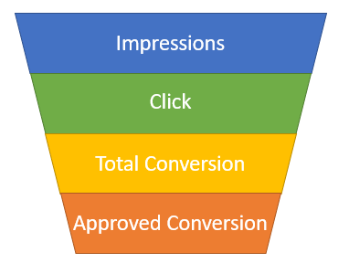
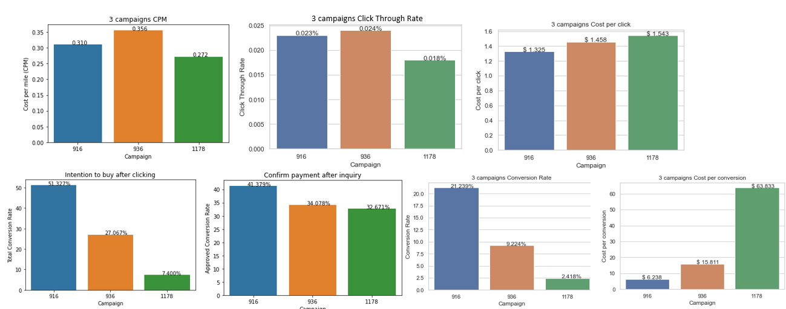

# Object: Facebook Ads Analysis and Prediction for Company
## Steps:
### 1.	Load Data
### 2.	Data understanding
- Categorical features and their unique values
- Numerical features, outliers
- Find the features correlation matrix
### 3.	Observation from Data Visualization
- There 3 different campaigns that this company is using, and campaigns # 1178 has the most count, while campaign #916 has the least.
- We have 4 different age groups, and age 30-34 has the most count here.
- Age group 40-44 has most engagement in campaign #916, while age group 30-34 has the most engagement in campaign #1178. Campaign # 936 has relative the same engagement among all 4 age groups, and 30-34 is relatively higher.
- Gender wise, more male than female in this dataset, and #916 & #936 male engagement is slightly higher than female group, while #1178 female has higher engagement.
-	Gender vs. Age: for group 1 (30-34) and group 2 (35-39): more male; while group 3 (40-44) and group 4 (45-49): more female
-	the more you spent on ads, the more impression of the ads and clicks it will get.
### 4.	Data cleaning:
-	Categorical features engineering: transform with one-hot encoding or dummy variable
### 5.	Plotting the KPIs: Our goal is to optimize sales conversion (Approved_Conversion) and predict future sales, first we need to understand some KPIs：
-	Return on ad spend (ROAS): but we don't have the revenue data here
-	Cost per conversion (CPA): is a great indicator of ROI, able to see which campaign is the most effective. For facebook ads CPA is defined as cost to Per New User Registration. CPA = Spent / approved_conversion
-	Click Through Rate （CTR）= Clicks/Impressions
-	Conversion rate （CvR） = Approved_conversion / Clicks
-	Cost per click（CPC） = Spent / Clicks
##### Observations from KPI:
Based on the data we have, I have identified the Conversion Funnel below:
- Impressions: used to quantify the number of digital ads views; 
- Clicks: when people who view your ads and interested in the content results in click on the ads for more information
- Total Conversion: people who click the ads and have intention to make the purchase
- Approved Conversion: people who actually made the purchase. 

1. CPM means the cost per thousand impressions: Campaign 1178 has the lowest CPM  
2. CTR: 936 and 916 have higher click through rate relative lower cost per clicks, especially for campaign 916, which means these 2 campaigns attracted more people to click on it. And the company has spent much more on the campaign 1178, maybe the company should dig deeper through comparing ads design and content among these 3 campaigns.
3. Campaign 916 has the most inquiry after clicking the ads, and it has the highest Approved conversion rate with the lowest conversion cost, while campaign 1178 has the highest conversion cost with the lowest approved conversion rate. 
 

### 6.	Modeling: 
-	Linear regression
-	Random forest regressor – based model
-	Random forest regressor – optimized by RandomizedSearchCV
-	Random forest regressor – optimized by GridSearchCV
-	It turns out that random forest regressor - optimized by RandomizedSearchCV returns the highest R2 score 76%

### 7. Business Insights:
1. Company should gradually increase spending on Campaign 916, and maybe compare the ads design and contents among 3 campaigns. Currently company spent the most on campaign 1178, but it has the worst performance. 
 - Now we don't have enough sample size for Campaign 916, we cannot make the decision that Campaign 916 is definitely better than 1178, but we can continue the finds and compare the result after increasing the sample size. 
3. Based on our Data Visualization and Model prediction, the campaign ads should target on age group from 30-34, and male since they have a higher conversion rate with lower Cost per conversion. 
4. Interest in category #112, #27, #101, #29, #104 have relatively higher feature importance. Increase ad spending on high performaning intereste categories. 
